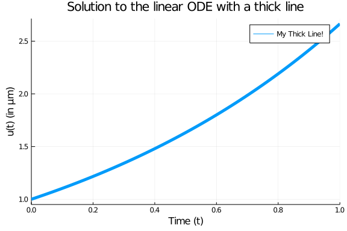
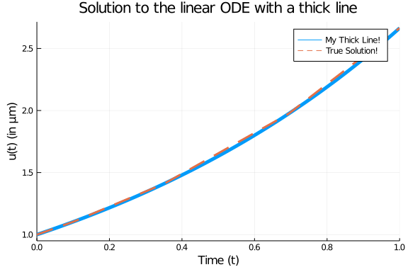
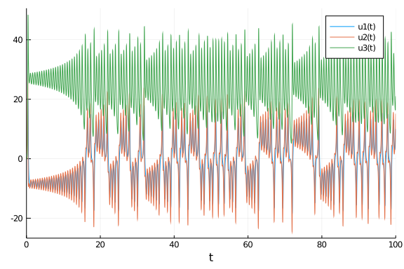
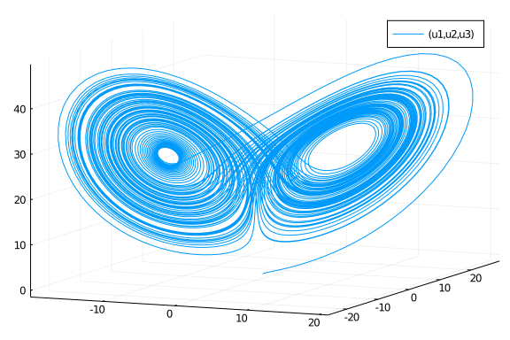

## Basic Introduction Via Ordinary Differential Equations

This notebook will get you started with DifferentialEquations.jl by introducing you to the functionality for solving ordinary differential equations (ODEs). The corresponding documentation page is the [ODE tutorial](https://docs.sciml.ai/dev/tutorials/ode_example/). While some of the syntax may be different for other types of equations, the same general principles hold in each case. Our goal is to give a gentle and thorough introduction that highlights these principles in a way that will help you generalize what you have learned.

### Background

If you are new to the study of differential equations, it can be helpful to do a quick background read on [the definition of ordinary differential equations](https://en.wikipedia.org/wiki/Ordinary_differential_equation). We define an ordinary differential equation as an equation which describes the way that a variable $u$ changes, that is

$$u' = f(u,p,t)$$

where $p$ are the parameters of the model, $t$ is the time variable, and $f$ is the nonlinear model of how $u$ changes. The initial value problem also includes the information about the starting value:

$$u(t_0) = u_0$$

Together, if you know the starting value and you know how the value will change with time, then you know what the value will be at any time point in the future. This is the intuitive definition of a differential equation.

### First Model: Exponential Growth

Our first model will be the canonical exponential growth model. This model says that the rate of change is proportional to the current value, and is this:

$$u' = au$$

where we have a starting value $u(0)=u_0$. Let's say we put 1 dollar into Bitcoin which is increasing at a rate of $98\%$ per year. Then calling now $t=0$ and measuring time in years, our model is:

$$u' = 0.98u$$

and $u(0) = 1.0$. We encode this into Julia by noticing that, in this setup, we match the general form when

````julia
f(u,p,t) = 0.98u
````


````
f (generic function with 1 method)
````


with $ u_0 = 1.0 $. If we want to solve this model on a time span from `t=0.0` to `t=1.0`, then we define an `ODEProblem` by specifying this function `f`, this initial condition `u0`, and this time span as follows:

````julia
using DifferentialEquations
f(u,p,t) = 0.98u
u0 = 1.0
tspan = (0.0,1.0)
prob = ODEProblem(f,u0,tspan)
````


````
ODEProblem with uType Float64 and tType Float64. In-place: false
timespan: (0.0, 1.0)
u0: 1.0
````


To solve our `ODEProblem` we use the command `solve`.

````julia
sol = solve(prob)
````


````
retcode: Success
Interpolation: automatic order switching interpolation
t: 5-element Array{Float64,1}:
 0.0
 0.10042494449239292
 0.35218603951893646
 0.6934436028208104
 1.0
u: 5-element Array{Float64,1}:
 1.0
 1.1034222047865465
 1.4121908848175448
 1.9730384275622996
 2.664456142481451
````


and that's it: we have succesfully solved our first ODE!

#### Analyzing the Solution

Of course, the solution type is not interesting in and of itself. We want to understand the solution! The documentation page which explains in detail the functions for analyzing the solution is the [Solution Handling](https://docs.sciml.ai/dev/basics/solution/) page. Here we will describe some of the basics. You can plot the solution using the plot recipe provided by [Plots.jl](http://docs.juliaplots.org/dev/):

````julia
using Plots; gr()
plot(sol)
````


From the picture we see that the solution is an exponential curve, which matches our intuition. As a plot recipe, we can annotate the result using any of the [Plots.jl attributes](http://docs.juliaplots.org/dev/attributes/). For example:

````julia
plot(sol,linewidth=5,title="Solution to the linear ODE with a thick line",
     xaxis="Time (t)",yaxis="u(t) (in μm)",label="My Thick Line!") # legend=false
````





Using the mutating `plot!` command we can add other pieces to our plot. For this ODE we know that the true solution is $u(t) = u_0 exp(at)$, so let's add some of the true solution to our plot:

````julia
plot!(sol.t, t->1.0*exp(0.98t),lw=3,ls=:dash,label="True Solution!")
````





In the previous command I demonstrated `sol.t`, which grabs the array of time points that the solution was saved at:

````julia
sol.t
````


````
5-element Array{Float64,1}:
 0.0
 0.10042494449239292
 0.35218603951893646
 0.6934436028208104
 1.0
````


We can get the array of solution values using `sol.u`:

````julia
sol.u
````


````
5-element Array{Float64,1}:
 1.0
 1.1034222047865465
 1.4121908848175448
 1.9730384275622996
 2.664456142481451
````


`sol.u[i]` is the value of the solution at time `sol.t[i]`. We can compute arrays of functions of the solution values using standard comprehensions, like:

````julia
[t+u for (u,t) in tuples(sol)]
````


````
5-element Array{Float64,1}:
 1.0
 1.2038471492789395
 1.7643769243364813
 2.66648203038311
 3.664456142481451
````


However, one interesting feature is that, by default, the solution is a continuous function. If we check the print out again:

````julia
sol
````


````
retcode: Success
Interpolation: automatic order switching interpolation
t: 5-element Array{Float64,1}:
 0.0
 0.10042494449239292
 0.35218603951893646
 0.6934436028208104
 1.0
u: 5-element Array{Float64,1}:
 1.0
 1.1034222047865465
 1.4121908848175448
 1.9730384275622996
 2.664456142481451
````


you see that it says that the solution has a order changing interpolation. The default algorithm automatically switches between methods in order to handle all types of problems. For non-stiff equations (like the one we are solving), it is a continuous function of 4th order accuracy. We can call the solution as a function of time `sol(t)`. For example, to get the value at `t=0.45`, we can use the command:

````julia
sol(0.45)
````


````
1.554261048055312
````


#### Controlling the Solver

DifferentialEquations.jl has a common set of solver controls among its algorithms which can be found [at the Common Solver Options](https://docs.sciml.ai/dev/basics/common_solver_opts/) page. We will detail some of the most widely used options.

The most useful options are the tolerances `abstol` and `reltol`. These tell the internal adaptive time stepping engine how precise of a solution you want. Generally, `reltol` is the relative accuracy while `abstol` is the accuracy when `u` is near zero. These tolerances are local tolerances and thus are not global guarantees. However, a good rule of thumb is that the total solution accuracy is 1-2 digits less than the relative tolerances. Thus for the defaults `abstol=1e-6` and `reltol=1e-3`, you can expect a global accuracy of about 1-2 digits. If we want to get around 6 digits of accuracy, we can use the commands:

````julia
sol = solve(prob,abstol=1e-8,reltol=1e-8)
````


````
retcode: Success
Interpolation: automatic order switching interpolation
t: 9-element Array{Float64,1}:
 0.0
 0.04127492324135852
 0.14679917846877366
 0.28631546412766684
 0.4381941361169628
 0.6118924302028597
 0.7985659100883337
 0.9993516479536952
 1.0
u: 9-element Array{Float64,1}:
 1.0
 1.0412786454705882
 1.1547261252949712
 1.3239095703537043
 1.5363819257509728
 1.8214895157178692
 2.1871396448296223
 2.662763824115295
 2.664456241933517
````


Now we can see no visible difference against the true solution:


````julia
plot(sol)
plot!(sol.t, t->1.0*exp(0.98t),lw=3,ls=:dash,label="True Solution!")
````


Notice that by decreasing the tolerance, the number of steps the solver had to take was `9` instead of the previous `5`. There is a trade off between accuracy and speed, and it is up to you to determine what is the right balance for your problem.

Another common option is to use `saveat` to make the solver save at specific time points. For example, if we want the solution at an even grid of `t=0.1k` for integers `k`, we would use the command:

````julia
sol = solve(prob,saveat=0.1)
````


````
retcode: Success
Interpolation: 1st order linear
t: 11-element Array{Float64,1}:
 0.0
 0.1
 0.2
 0.3
 0.4
 0.5
 0.6
 0.7
 0.8
 0.9
 1.0
u: 11-element Array{Float64,1}:
 1.0
 1.102962785129292
 1.2165269512238264
 1.341783821227542
 1.4799379510586077
 1.632316207054161
 1.8003833264983584
 1.9857565541588758
 2.1902158127997695
 2.415725742084496
 2.664456142481451
````


Notice that when `saveat` is used the continuous output variables are no longer saved and thus `sol(t)`, the interpolation, is only first order. We can save at an uneven grid of points by passing a collection of values to `saveat`. For example:

````julia
sol = solve(prob,saveat=[0.2,0.7,0.9])
````


````
retcode: Success
Interpolation: 1st order linear
t: 3-element Array{Float64,1}:
 0.2
 0.7
 0.9
u: 3-element Array{Float64,1}:
 1.2165269512238264
 1.9857565541588758
 2.415725742084496
````


If we need to reduce the amount of saving, we can also turn off the continuous output directly via `dense=false`:

````julia
sol = solve(prob,dense=false)
````


````
retcode: Success
Interpolation: 1st order linear
t: 5-element Array{Float64,1}:
 0.0
 0.10042494449239292
 0.35218603951893646
 0.6934436028208104
 1.0
u: 5-element Array{Float64,1}:
 1.0
 1.1034222047865465
 1.4121908848175448
 1.9730384275622996
 2.664456142481451
````


and to turn off all intermediate saving we can use `save_everystep=false`:

````julia
sol = solve(prob,save_everystep=false)
````


````
retcode: Success
Interpolation: 1st order linear
t: 2-element Array{Float64,1}:
 0.0
 1.0
u: 2-element Array{Float64,1}:
 1.0
 2.664456142481451
````


If we want to solve and only save the final value, we can even set `save_start=false`.

````julia
sol = solve(prob,save_everystep=false,save_start = false)
````


````
retcode: Success
Interpolation: 1st order linear
t: 1-element Array{Float64,1}:
 1.0
u: 1-element Array{Float64,1}:
 2.664456142481451
````


Note that similarly on the other side there is `save_end=false`.

More advanced saving behaviors, such as saving functionals of the solution, are handled via the `SavingCallback` in the [Callback Library](https://docs.sciml.ai/dev/features/callback_library/#saving_callback-1) which will be addressed later in the tutorial.

#### Choosing Solver Algorithms

There is no best algorithm for numerically solving a differential equation. When you call `solve(prob)`, DifferentialEquations.jl makes a guess at a good algorithm for your problem, given the properties that you ask for (the tolerances, the saving information, etc.). However, in many cases you may want more direct control. A later notebook will help introduce the various *algorithms* in DifferentialEquations.jl, but for now let's introduce the *syntax*.

The most crucial determining factor in choosing a numerical method is the stiffness of the model. Stiffness is roughly characterized by a Jacobian `f` with large eigenvalues. That's quite mathematical, and we can think of it more intuitively: if you have big numbers in `f` (like parameters of order `1e5`), then it's probably stiff. Or, as the creator of the MATLAB ODE Suite, Lawrence Shampine, likes to define it, if the standard algorithms are slow, then it's stiff. We will go into more depth about diagnosing stiffness in a later tutorial, but for now note that if you believe your model may be stiff, you can hint this to the algorithm chooser via `alg_hints = [:stiff]`.

````julia
sol = solve(prob,alg_hints=[:stiff])
````


````
retcode: Success
Interpolation: specialized 3rd order "free" stiffness-aware interpolation
t: 8-element Array{Float64,1}:
 0.0
 0.05653299582822294
 0.17270731152826024
 0.3164602871490142
 0.5057500163821153
 0.7292241858994543
 0.9912975001018789
 1.0
u: 8-element Array{Float64,1}:
 1.0
 1.0569657840332976
 1.1844199383303913
 1.3636037723365293
 1.6415399686182572
 2.0434491434754793
 2.641825616057761
 2.6644526430553817
````


Stiff algorithms have to solve implicit equations and linear systems at each step so they should only be used when required.

If we want to choose an algorithm directly, you can pass the algorithm type after the problem as `solve(prob,alg)`. For example, let's solve this problem using the `Tsit5()` algorithm, and just for show let's change the relative tolerance to `1e-6` at the same time:

````julia
sol = solve(prob,Tsit5(),reltol=1e-6)
````


````
retcode: Success
Interpolation: specialized 4th order "free" interpolation
t: 10-element Array{Float64,1}:
 0.0
 0.028970819746309166
 0.10049147151547619
 0.19458908698515082
 0.3071725081673423
 0.43945421453622546
 0.5883434923759523
 0.7524873357619015
 0.9293021330536031
 1.0
u: 10-element Array{Float64,1}:
 1.0
 1.0287982807225062
 1.1034941463604806
 1.2100931078233779
 1.351248605624241
 1.538280340326815
 1.7799346012651116
 2.090571742234628
 2.486102171447025
 2.6644562434913377
````


### Systems of ODEs: The Lorenz Equation

Now let's move to a system of ODEs. The [Lorenz equation](https://en.wikipedia.org/wiki/Lorenz_system) is the famous "butterfly attractor" that spawned chaos theory. It is defined by the system of ODEs:

$$
\begin{align}
\frac{dx}{dt} &= \sigma (y - x)\\
\frac{dy}{dt} &= x (\rho - z) -y\\
\frac{dz}{dt} &= xy - \beta z
\end{align}
$$

To define a system of differential equations in DifferentialEquations.jl, we define our `f` as a vector function with a vector initial condition. Thus, for the vector `u = [x,y,z]'`, we have the derivative function:

````julia
function lorenz!(du,u,p,t)
    σ,ρ,β = p
    du[1] = σ*(u[2]-u[1])
    du[2] = u[1]*(ρ-u[3]) - u[2]
    du[3] = u[1]*u[2] - β*u[3]
end
````


````
lorenz! (generic function with 1 method)
````


Notice here we used the in-place format which writes the output to the preallocated vector `du`. For systems of equations the in-place format is faster. We use the initial condition $u_0 = [1.0,0.0,0.0]$ as follows:

````julia
u0 = [1.0,0.0,0.0]
````


````
3-element Array{Float64,1}:
 1.0
 0.0
 0.0
````


Lastly, for this model we made use of the parameters `p`. We need to set this value in the `ODEProblem` as well. For our model we want to solve using the parameters $\sigma = 10$, $\rho = 28$, and $\beta = 8/3$, and thus we build the parameter collection:

````julia
p = (10,28,8/3) # we could also make this an array, or any other type!
````


````
(10, 28, 2.6666666666666665)
````


Now we generate the `ODEProblem` type. In this case, since we have parameters, we add the parameter values to the end of the constructor call. Let's solve this on a time span of `t=0` to `t=100`:

````julia
tspan = (0.0,100.0)
prob = ODEProblem(lorenz!,u0,tspan,p)
````


````
ODEProblem with uType Array{Float64,1} and tType Float64. In-place: true
timespan: (0.0, 100.0)
u0: [1.0, 0.0, 0.0]
````


Now, just as before, we solve the problem:

````julia
sol = solve(prob)
````


````
retcode: Success
Interpolation: automatic order switching interpolation
t: 1294-element Array{Float64,1}:
   0.0
   3.5678604836301404e-5
   0.0003924646531993154
   0.0032624077544510573
   0.009058075635317072
   0.01695646895607931
   0.0276899566248403
   0.041856345938267966
   0.06024040228733675
   0.08368539694547242
   ⋮
  99.39403070915297
  99.47001147494375
  99.54379656909015
  99.614651558349
  99.69093823148101
  99.78733023233721
  99.86114450046736
  99.96115759510786
 100.0
u: 1294-element Array{Array{Float64,1},1}:
 [1.0, 0.0, 0.0]
 [0.9996434557625105, 0.0009988049817849058, 1.781434788799208e-8]
 [0.9961045497425811, 0.010965399721242457, 2.146955365838907e-6]
 [0.9693591634199452, 0.08977060667778931, 0.0001438018342266937]
 [0.9242043615038835, 0.24228912482984957, 0.0010461623302512404]
 [0.8800455868998046, 0.43873645009348244, 0.0034242593451028745]
 [0.8483309877783048, 0.69156288756671, 0.008487623500490047]
 [0.8495036595681027, 1.0145425335433382, 0.01821208597613427]
 [0.9139069079152129, 1.4425597546855036, 0.03669381053327124]
 [1.0888636764765296, 2.052326153029042, 0.07402570506414284]
 ⋮
 [12.999157033749652, 14.10699925404482, 31.74244844521858]
 [11.646131422021162, 7.2855792145502845, 35.365000488215486]
 [7.777555445486692, 2.5166095828739574, 32.030953593541675]
 [4.739741627223412, 1.5919220588229062, 27.249779003951755]
 [3.2351668945618774, 2.3121727966182695, 22.724936101772805]
 [3.310411964698304, 4.28106626744641, 18.435441144016366]
 [4.527117863517627, 6.895878639772805, 16.58544600757436]
 [8.043672261487556, 12.711555298531689, 18.12537420595938]
 [9.97537965430362, 15.143884806010783, 21.00643286956427]
````


The same solution handling features apply to this case. Thus `sol.t` stores the time points and `sol.u` is an array storing the solution at the corresponding time points.

However, there are a few extra features which are good to know when dealing with systems of equations. First of all, `sol` also acts like an array. `sol[i]` returns the solution at the `i`th time point.

````julia
sol.t[10],sol[10]
````


````
(0.08368539694547242, [1.0888636764765296, 2.052326153029042, 0.07402570506
414284])
````


Additionally, the solution acts like a matrix where `sol[j,i]` is the value of the `j`th variable at time `i`:

````julia
sol[2,10]
````


````
2.052326153029042
````


We can get a real matrix by performing a conversion:

````julia
A = Array(sol)
````


````
3×1294 Array{Float64,2}:
 1.0  0.999643     0.996105    0.969359     …   4.52712   8.04367   9.97538
 0.0  0.000998805  0.0109654   0.0897706        6.89588  12.7116   15.1439
 0.0  1.78143e-8   2.14696e-6  0.000143802     16.5854   18.1254   21.0064
````


This is the same as sol, i.e. `sol[i,j] = A[i,j]`, but now it's a true matrix. Plotting will by default show the time series for each variable:

````julia
plot(sol)
````





If we instead want to plot values against each other, we can use the `vars` command. Let's plot variable `1` against variable `2` against variable `3`:

````julia
plot(sol,vars=(1,2,3))
````





This is the classic Lorenz attractor plot, where the `x` axis is `u[1]`, the `y` axis is `u[2]`, and the `z` axis is `u[3]`. Note that the plot recipe by default uses the interpolation, but we can turn this off:

````julia
plot(sol,vars=(1,2,3),denseplot=false)
````


Yikes! This shows how calculating the continuous solution has saved a lot of computational effort by computing only a sparse solution and filling in the values! Note that in vars, `0=time`, and thus we can plot the time series of a single component like:

````julia
plot(sol,vars=(0,2))
````


## Internal Types

The last basic user-interface feature to explore is the choice of types. DifferentialEquations.jl respects your input types to determine the internal types that are used. Thus since in the previous cases, when we used `Float64` values for the initial condition, this meant that the internal values would be solved using `Float64`. We made sure that time was specified via `Float64` values, meaning that time steps would utilize 64-bit floats as well. But, by simply changing these types we can change what is used internally.

As a quick example, let's say we want to solve an ODE defined by a matrix. To do this, we can simply use a matrix as input.

````julia
A  = [1. 0  0 -5
      4 -2  4 -3
     -4  0  0  1
      5 -2  2  3]
u0 = rand(4,2)
tspan = (0.0,1.0)
f(u,p,t) = A*u
prob = ODEProblem(f,u0,tspan)
sol = solve(prob)
````


````
retcode: Success
Interpolation: automatic order switching interpolation
t: 10-element Array{Float64,1}:
 0.0
 0.035837145273206604
 0.09398941811515005
 0.1711376760453636
 0.268191831977834
 0.379912344355524
 0.5067002136400818
 0.6591129107963655
 0.8295266708196971
 1.0
u: 10-element Array{Array{Float64,2},1}:
 [0.18084059433736632 0.6735843499165595; 0.3919291156743039 0.115742286780
54488; 0.40979783636057543 0.05395672549875652; 0.020631558005682837 0.0982
4514959105457]
 [0.18046325993955636 0.668686753580626; 0.4408350224439239 0.1850137351973
129; 0.3852002493779446 -0.036721323047792714; 0.05579205524922205 0.225872
4549433267]
 [0.16655433987985668 0.6102374663148857; 0.4975366228736487 0.228314853566
535; 0.3493408640369401 -0.167515990426645; 0.1089016604415104 0.4339295839
870391]
 [0.12386822230553543 0.4314730648443703; 0.5325623530093845 0.156577054425
4565; 0.31465828523555234 -0.28733211161914185; 0.1691757802961833 0.702842
1494344252]
 [0.03560974297215906 0.03857849082803655; 0.5220504563429157 -0.1229849351
6288994; 0.30183315737344385 -0.3011683697965832; 0.22302549836951152 1.008
3219085764692]
 [-0.10101207299364791 -0.6357986239205559; 0.45967491107086084 -0.64175248
33350452; 0.34203420153287106 -0.047480516997589206; 0.24639689588530547 1.
2751457854543928]
 [-0.2739142208109207 -1.6384011625137633; 0.3715690742276302 -1.3342620235
00564; 0.46690336065353466 0.6924903842987244; 0.21270864269720302 1.402777
4296771829]
 [-0.44714881115771116 -3.0119983730557074; 0.329338443182707 -1.9715608166
3602; 0.7140441613724511 2.311174601725102; 0.07752908941628911 1.198490978
9188136]
 [-0.4887018088262447 -4.360217640724318; 0.48882107525514373 -1.8128860253
65758; 1.037498127480093 4.994001467744241; -0.19453130773147526 0.35527938
740192766]
 [-0.2375674812350816 -4.836668317759423; 0.9640684228881622 0.012009728048
617108; 1.2418221688721471 8.13749460005548; -0.5631971391401789 -1.2496559
97163155]
````


There is no real difference from what we did before, but now in this case `u0` is a `4x2` matrix. Because of that, the solution at each time point is matrix:

````julia
sol[3]
````


````
4×2 Array{Float64,2}:
 0.166554   0.610237
 0.497537   0.228315
 0.349341  -0.167516
 0.108902   0.43393
````


In DifferentialEquations.jl, you can use any type that defines `+`, `-`, `*`, `/`, and has an appropriate `norm`. For example, if we want arbitrary precision floating point numbers, we can change the input to be a matrix of `BigFloat`:

````julia
big_u0 = big.(u0)
````


````
4×2 Array{BigFloat,2}:
 0.180841   0.673584
 0.391929   0.115742
 0.409798   0.0539567
 0.0206316  0.0982451
````


and we can solve the `ODEProblem` with arbitrary precision numbers by using that initial condition:

````julia
prob = ODEProblem(f,big_u0,tspan)
sol = solve(prob)
````


````
retcode: Success
Interpolation: automatic order switching interpolation
t: 6-element Array{Float64,1}:
 0.0
 0.03583714527320661
 0.194991627996516
 0.4630908878992731
 0.7738689450854899
 1.0
u: 6-element Array{Array{BigFloat,2},1}:
 [0.180840594337366322719162781140767037868499755859375 0.67358434991655946
61093336981139145791530609130859375; 0.391929115674303885086260379466693848
3715057373046875 0.1157422867805448785105681963614188134670257568359375; 0.
4097978363605754292819938200409524142742156982421875 0.05395672549875651924
367048195563256740570068359375; 0.02063155800568283737561614543665200471878
0517578125 0.098245149591054570237247389741241931915283203125]
 [0.18046325995131074329680206830171249007470482198494826290056905524309964
81233001 0.6686867535559108059295867219765721127951378795348981729869849547
65248107833721; 0.440835022506285910989408159063749257357965553497286667822
3419420313377365502566 0.18501373529395864782778966615931618739499562111576
45776441992995783443435448086; 0.385200249392126245095561626509380948562874
6374689013239265425038577337437424397 -0.0367213229552684336244847902952200
2396480803649781740886817987421739096256581344; 0.0557920552562442757562023
1924151710408344978457224004421146848726281004897564656 0.22587245496731128
49314184330475606391416315173626100090348712790753934204235484]
 [0.10547703034177362439350255007441731335063112010670883316886097772844573
40603811 0.3522533250329559300119164222850785485772118290325990645063435686
400075800467833; 0.53504762541413646907828074075312452183315726517395670042
61408717249377938597654 0.1061517677316854755896229623351328922969370593005
620262571708848950439057280248; 0.30792452730653374050978535175601079080480
66096835640232057289391129071562286078 -0.307094477860558234604283890197493
5073446703005292695693358702957544322354062298; 0.1849158865576971328612148
706760132137774135583345140470747854630631101812570937 0.782311740584947737
6053157484623593176543974062060345835689686076559677283781262]
 [-0.2146119388544682097509788570702059120401434894266698921372629210432438
291156372 -1.27061491587453777575531160724039860820559145184321930001017483
11697763517666; 0.400279847801579304687196073100941518073977178965324445005
3573071526480518793656 -1.0966901427114702444368859017797817893680903464740
5219240349218831228963495791; 0.4145423175382236439927787820992223250366827
924779039295686918005488368905290253 0.378175837600583377122734415267606006
6550494502501622469613123956805782637033663; 0.2320743638792340111930032049
699383439581369157405198464464179597759198431120964 1.384610241749128331455
041102454272566419104624978467120579628448276573049195272]
 [-0.5007388901746559488726073855979382218862372409760013705983512955257269
188458692 -3.97761001712052096066882379884819955781609860297045357874983176
6787724531114264; 0.4054437292182935343690236818372656500204961215185185688
007501422715668232119771 -2.01135300614574587258027419566518722473638550218
5847237037148688233166079725376; 0.9347633882096348038141402567915122222847
200879354289368934470656643552544978856 4.034403092055063676460661348725082
907051905131653939245818107584110431747665469; -0.0927458538133758667432156
1553342752971136280848292079577557193889803788404885261 0.71082463180865434
77833285178760532075228378207734550454183025122427170439039984]
 [-0.2375655989766289351282818445536500839629577310739211258106406999458269
079227208 -4.83667706389088251850564926958517276803224806331741856851561347
1494241592720632; 0.9640742203046870982916028247124909723589491965795135469
142904744642675147665146 0.012026382514392620743978690885045373060404761873
16632796454241152766663517092376; 1.241824630195814033553847556076939963741
099321798557522891495291539848825475431 8.137527291010752967371510077875190
577899551994606589389989645911041838467192255; -0.5632001619743111957736049
762644356956324697112698587854590775045087184782546935 -1.24966846338776872
5591003859894959509238124974757938359952696079488339402465239]
````


````julia
sol[1,3]
````


````
0.1054770303417736243935025500744173133506311201067088331688609777284457340
603811
````


To really make use of this, we would want to change `abstol` and `reltol` to be small! Notice that the type for "time" is different than the type for the dependent variables, and this can be used to optimize the algorithm via keeping multiple precisions. We can convert time to be arbitrary precision as well by defining our time span with `BigFloat` variables:

````julia
prob = ODEProblem(f,big_u0,big.(tspan))
sol = solve(prob)
````


````
retcode: Success
Interpolation: automatic order switching interpolation
t: 6-element Array{BigFloat,1}:
 0.0
 0.035837145273206608178723189167339137857095534903468664917505359195347374
23204982
 0.194991627996515979217804394973535599921567308095355171016973940049211908
9884716
 0.463090887899273020530156824014946889035006382941401467731341887223824925
6842297
 0.773868945085489624549045514310018071694747329429624922220186895675646448
2974645
 1.0
u: 6-element Array{Array{BigFloat,2},1}:
 [0.180840594337366322719162781140767037868499755859375 0.67358434991655946
61093336981139145791530609130859375; 0.391929115674303885086260379466693848
3715057373046875 0.1157422867805448785105681963614188134670257568359375; 0.
4097978363605754292819938200409524142742156982421875 0.05395672549875651924
367048195563256740570068359375; 0.02063155800568283737561614543665200471878
0517578125 0.098245149591054570237247389741241931915283203125]
 [0.18046325995131074356662620158769456298353824766849576751143156292314819
57783773 0.6686867535559108071915678244221257918931362633737084633492855593
948627019659233; 0.44083502250628590766483354593457161018538726733771288629
0856416350976045121738 0.18501373529395864377286238543097559345673813177862
62930575830024914501352581295; 0.385200249392126246920178600383809181581341
7978086214448062509436192742592738103 -0.0367213229552684269160028474084198
5862907575616335112054001140883844227770361728; 0.0557920552562442731306848
8575359175973503978489626860474483473630035272041739596 0.22587245496731127
513094190167030740878031937039802267843386972792164086151868]
 [0.10547703034177364903586446941265849085657970596369460349261279189330818
51446576 0.3522533250329560370921679884642277592718918962138768689191289377
514404580402027; 0.53504762541413646821294797137891029476293620166061606844
79276648493804408495446 0.1061517677316855471489357946409619570751939406063
065166698026943688107711988088; 0.30792452730653374763960014155661966819808
49202039011509984942656173272997454979 -0.307094477860558215750222920176060
5518897008164779362686960152697734571150537167; 0.1849158865576971139715019
717657115156632348880362748243228332253214988431866827 0.782311740584947638
8764273661869517449477590933250834858133726536677916324326434]
 [-0.2146119388544680526499783059115886830471181037400863945339231680797528
011617107 -1.27061491587453683957468371948949588237502762188086545121029150
7582922781830084; 0.4002798478015793843310604305141846004576684168117035267
883718652821936310438161 -1.09669014271146961257414559087044939721570022451
6480861847891670770450405681655; 0.4145423175382235193934039266927032516183
471541035136210020400652880132436128887 0.378175837600582638217151796514327
2538983778336510833096915194273958574596751799; 0.2320743638792340509899185
204826100253512487010923767020456986416738900304348777 1.384610241749128245
706808266384673973812180557026050828247699762142528773573833]
 [-0.5007388901746559409006362313182505067290462865994494904448966585591709
028928521 -3.97761001712051933830887569347964167007444388182066265352816133
0546840323732766; 0.4054437292182932751423385962833642983697728370960068813
59815635683257663056588 -2.011353006145746328676274472241944655047177600404
328052564860805146820706463074; 0.93476338820963439234872830995177945763420
47952204520983261087211883504419678039 4.0344030920550600961857278545471264
09573172930223148788851170379316701047075139; -0.09274585381337549554031239
546365706947304498393809063158412877404364447107910032 0.710824631808655567
8413460606867351183645296484721313404784406029032226857640423]
 [-0.2375655989766288635623445937698041316088398338324418675676537220259683
109363916 -4.83667706389088247932421890526157374482068130187471835745441467
5036155870062889; 0.9640742203046872031657291038113834457202187672024569551
47720536005092765000437 0.0120263825143930906000951047150891152985436824793
0366545333596687897331867319626; 1.2418246301958140442970293004983402005682
41217176261307562452032512373044316663 8.1375272910107534696654638963324004
11885665267029395648207824836185704394115608; -0.56320016197431126022005696
0096451776085620357944243292217147412965006226427203 -1.2496684633877690498
1468517109509246001332365789552498117853757303889859295492]
````


Let's end by showing a more complicated use of types. For small arrays, it's usually faster to do operations on static arrays via the package [StaticArrays.jl](https://github.com/JuliaArrays/StaticArrays.jl). The syntax is similar to that of normal arrays, but for these special arrays we utilize the `@SMatrix` macro to indicate we want to create a static array.

````julia
using StaticArrays
A  = @SMatrix [ 1.0  0.0 0.0 -5.0
                4.0 -2.0 4.0 -3.0
               -4.0  0.0 0.0  1.0
                5.0 -2.0 2.0  3.0]
u0 = @SMatrix rand(4,2)
tspan = (0.0,1.0)
f(u,p,t) = A*u
prob = ODEProblem(f,u0,tspan)
sol = solve(prob)
````


````
retcode: Success
Interpolation: automatic order switching interpolation
t: 11-element Array{Float64,1}:
 0.0
 0.031534234320871164
 0.0903538209535513
 0.16273285285168482
 0.2540631921245806
 0.3596373654404972
 0.48240494481565993
 0.6122298297351463
 0.7546228200119018
 0.9245258073639878
 1.0
u: 11-element Array{StaticArrays.SArray{Tuple{4,2},Float64,2,8},1}:
 [0.6282568043393855 0.07569384480412289; 0.04863254826785712 0.55609408933
31805; 0.31211882496530063 0.9136754860465177; 0.8384047176976088 0.9599419
335396784]
 [0.4986928982171224 -0.08534832172191445; 0.06432701968506847 0.5414625992
000579; 0.27016687131620104 0.9462228296202699; 1.0306218063241135 1.079841
01075332]
 [0.1651626783359869 -0.44738910343408234; -0.011337417684148102 0.44931018
04563632; 0.26046096335881863 1.0767262597090688; 1.369185538579408 1.27045
9812784981]
 [-0.40594149770977866 -0.9906310561270396; -0.2701642727359141 0.248683491
38858778; 0.403824275225324 1.3808811481826337; 1.7330447962591307 1.432696
9038354638]
 [-1.3592894238728734 -1.792159817488078; -0.7902177270473212 -0.0662864183
0804141; 0.8938148073872584 2.0211195946103806; 2.0709810894814216 1.495551
80432164]
 [-2.719797153268021 -2.7913538364585055; -1.5046136671569859 -0.3640986760
079169; 1.9765519813167867 3.139792985505065; 2.227260778467857 1.327087942
059268]
 [-4.481072011152188 -3.8611293084992315; -2.1684641943714724 -0.3449016776
0947005; 4.005681152109637 4.9141846701290675; 1.98884828146129 0.747182250
5878576]
 [-6.226827745091287 -4.567945906464105; -2.1798109262526673 0.477796149555
5902; 7.009832028724327 7.160548035095383; 1.122495415136825 -0.36332239361
229646]
 [-7.4285727227720315 -4.352992416018494; -0.6898836927321059 2.76009030466
595; 10.994208707479649 9.590290824212643; -0.6663422289601704 -2.164618585
8788]
 [-6.795457540002504 -1.948167355445622; 4.068291748349399 7.75024954461039
2; 15.615881464483781 11.292130406109363; -3.9656334476726434 -4.9312991163
23148]
 [-5.429150981768089 0.0882010186754072; 7.401221298698479 10.7376323149607
52; 17.114431832927888 11.167200396917249; -5.775251136289583 -6.2551084200
70851]
````


````julia
sol[3]
````


````
4×2 StaticArrays.SArray{Tuple{4,2},Float64,2,8} with indices SOneTo(4)×SOne
To(2):
  0.165163   -0.447389
 -0.0113374   0.44931
  0.260461    1.07673
  1.36919     1.27046
````


## Conclusion

These are the basic controls in DifferentialEquations.jl. All equations are defined via a problem type, and the `solve` command is used with an algorithm choice (or the default) to get a solution. Every solution acts the same, like an array `sol[i]` with `sol.t[i]`, and also like a continuous function `sol(t)` with a nice plot command `plot(sol)`. The Common Solver Options can be used to control the solver for any equation type. Lastly, the types used in the numerical solving are determined by the input types, and this can be used to solve with arbitrary precision and add additional optimizations (this can be used to solve via GPUs for example!). While this was shown on ODEs, these techniques generalize to other types of equations as well.


## Appendix

 This tutorial is part of the SciMLTutorials.jl repository, found at: <https://github.com/SciML/SciMLTutorials.jl>.
 For more information on doing scientific machine learning (SciML) with open source software, check out <https://sciml.ai/>.

To locally run this tutorial, do the following commands:
```
using SciMLTutorials
SciMLTutorials.weave_file("introduction","01-ode_introduction.jmd")
```

Computer Information:
```
Julia Version 1.4.2
Commit 44fa15b150* (2020-05-23 18:35 UTC)
Platform Info:
  OS: Linux (x86_64-pc-linux-gnu)
  CPU: Intel(R) Core(TM) i7-9700K CPU @ 3.60GHz
  WORD_SIZE: 64
  LIBM: libopenlibm
  LLVM: libLLVM-8.0.1 (ORCJIT, skylake)
Environment:
  JULIA_LOAD_PATH = /builds/JuliaGPU/DiffEqTutorials.jl:
  JULIA_DEPOT_PATH = /builds/JuliaGPU/DiffEqTutorials.jl/.julia
  JULIA_CUDA_MEMORY_LIMIT = 2147483648
  JULIA_NUM_THREADS = 8

```

Package Information:

```
Status `/builds/JuliaGPU/DiffEqTutorials.jl/tutorials/introduction/Project.toml`
[6e4b80f9-dd63-53aa-95a3-0cdb28fa8baf] BenchmarkTools 0.5.0
[0c46a032-eb83-5123-abaf-570d42b7fbaa] DifferentialEquations 6.15.0
[65888b18-ceab-5e60-b2b9-181511a3b968] ParameterizedFunctions 5.4.0
[91a5bcdd-55d7-5caf-9e0b-520d859cae80] Plots 1.5.8
[90137ffa-7385-5640-81b9-e52037218182] StaticArrays 0.12.4
[c3572dad-4567-51f8-b174-8c6c989267f4] Sundials 4.2.5
[37e2e46d-f89d-539d-b4ee-838fcccc9c8e] LinearAlgebra
```
