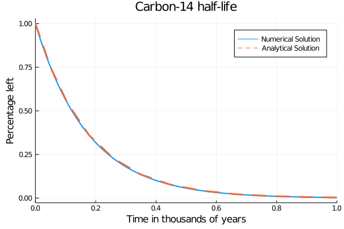
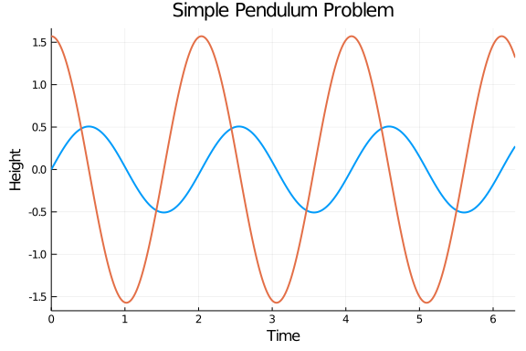
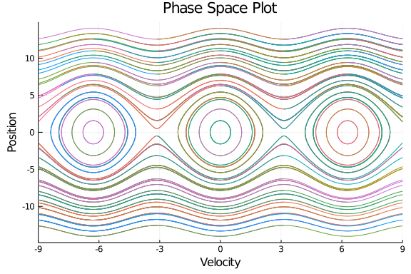
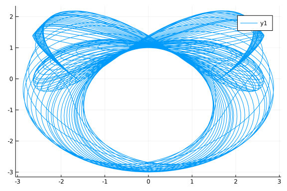
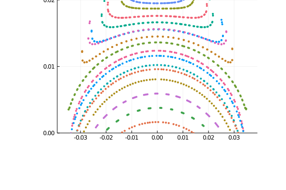
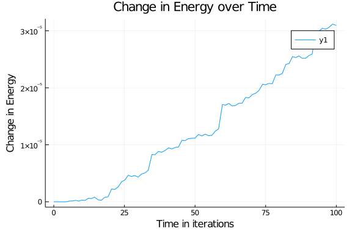
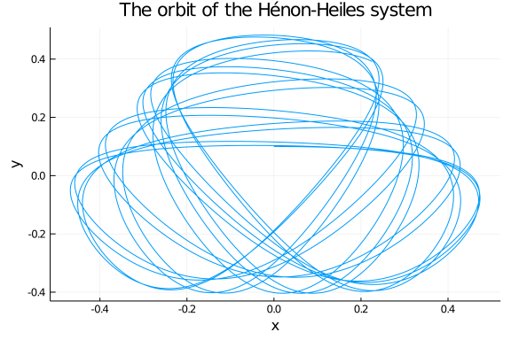
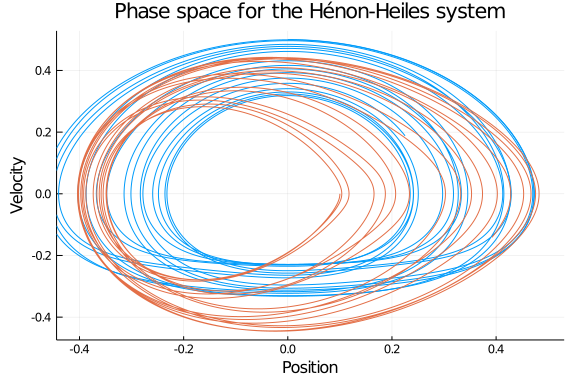
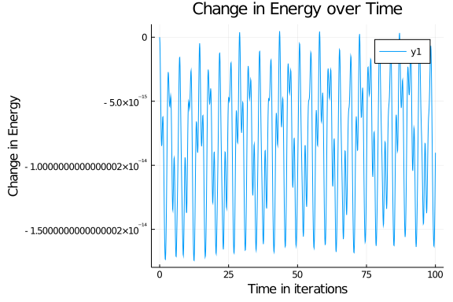
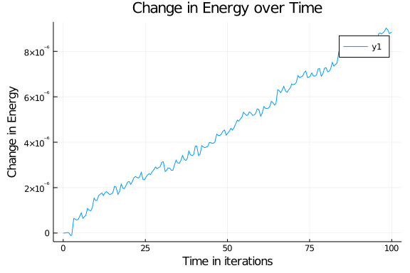

If you're getting some cold feet to jump in to DiffEq land, here are some handcrafted differential equations mini problems to hold your hand along the beginning of your journey.

## First order linear ODE

#### Radioactive Decay of Carbon-14

$$f(t,u) = \frac{du}{dt}$$

The Radioactive decay problem is the first order linear ODE problem of an exponential with a negative coefficient, which represents the half-life of the process in question. Should the coefficient be positive, this would represent a population growth equation.

````julia
using OrdinaryDiffEq, Plots
gr()

#Half-life of Carbon-14 is 5,730 years.
C₁ = 5.730

#Setup
u₀ = 1.0
tspan = (0.0, 1.0)

#Define the problem
radioactivedecay(u,p,t) = -C₁*u

#Pass to solver
prob = ODEProblem(radioactivedecay,u₀,tspan)
sol = solve(prob,Tsit5())

#Plot
plot(sol,linewidth=2,title ="Carbon-14 half-life", xaxis = "Time in thousands of years", yaxis = "Percentage left", label = "Numerical Solution")
plot!(sol.t, t->exp(-C₁*t),lw=3,ls=:dash,label="Analytical Solution")
````





## Second Order Linear ODE

#### Simple Harmonic Oscillator

Another classical example is the harmonic oscillator, given by
$$
\ddot{x} + \omega^2 x = 0
$$
with the known analytical solution
$$
\begin{align*}
x(t) &= A\cos(\omega t - \phi) \\
v(t) &= -A\omega\sin(\omega t - \phi),
\end{align*}
$$
where
$$
A = \sqrt{c_1 + c_2} \qquad\text{and}\qquad \tan \phi = \frac{c_2}{c_1}
$$
with $c_1, c_2$ constants determined by the initial conditions such that
$c_1$ is the initial position and $\omega c_2$ is the initial velocity.

Instead of transforming this to a system of ODEs to solve with `ODEProblem`,
we can use `SecondOrderODEProblem` as follows.

````julia
# Simple Harmonic Oscillator Problem
using OrdinaryDiffEq, Plots

#Parameters
ω = 1

#Initial Conditions
x₀ = [0.0]
dx₀ = [π/2]
tspan = (0.0, 2π)

ϕ = atan((dx₀[1]/ω)/x₀[1])
A = √(x₀[1]^2 + dx₀[1]^2)

#Define the problem
function harmonicoscillator(ddu,du,u,ω,t)
    ddu .= -ω^2 * u
end

#Pass to solvers
prob = SecondOrderODEProblem(harmonicoscillator, dx₀, x₀, tspan, ω)
sol = solve(prob, DPRKN6())

#Plot
plot(sol, vars=[2,1], linewidth=2, title ="Simple Harmonic Oscillator", xaxis = "Time", yaxis = "Elongation", label = ["x" "dx"])
plot!(t->A*cos(ω*t-ϕ), lw=3, ls=:dash, label="Analytical Solution x")
plot!(t->-A*ω*sin(ω*t-ϕ), lw=3, ls=:dash, label="Analytical Solution dx")
````


Note that the order of the variables (and initial conditions) is `dx`, `x`.
Thus, if we want the first series to be `x`, we have to flip the order with `vars=[2,1]`.

## Second Order Non-linear ODE

#### Simple Pendulum

We will start by solving the pendulum problem. In the physics class, we often solve this problem by small angle approximation, i.e. $ sin(\theta) \approx \theta$, because otherwise, we get an elliptic integral which doesn't have an analytic solution. The linearized form is

$$\ddot{\theta} + \frac{g}{L}{\theta} = 0$$

But we have numerical ODE solvers! Why not solve the *real* pendulum?

$$\ddot{\theta} + \frac{g}{L}{\sin(\theta)} = 0$$

Notice that now we have a second order ODE.
In order to use the same method as above, we nee to transform it into a system
of first order ODEs by employing the notation $d\theta = \dot{\theta}$.

$$
\begin{align*}
&\dot{\theta} = d{\theta} \\
&\dot{d\theta} = - \frac{g}{L}{\sin(\theta)}
\end{align*}
$$

````julia
# Simple Pendulum Problem
using OrdinaryDiffEq, Plots

#Constants
const g = 9.81
L = 1.0

#Initial Conditions
u₀ = [0,π/2]
tspan = (0.0,6.3)

#Define the problem
function simplependulum(du,u,p,t)
    θ = u[1]
    dθ = u[2]
    du[1] = dθ
    du[2] = -(g/L)*sin(θ)
end

#Pass to solvers
prob = ODEProblem(simplependulum, u₀, tspan)
sol = solve(prob,Tsit5())

#Plot
plot(sol,linewidth=2,title ="Simple Pendulum Problem", xaxis = "Time", yaxis = "Height", label = ["\\theta" "d\\theta"])
````





So now we know that behaviour of the position versus time. However, it will be useful to us to look at the phase space of the pendulum, i.e., and representation of all possible states of the system in question (the pendulum) by looking at its velocity and position. Phase space analysis is ubiquitous in the analysis of dynamical systems, and thus we will provide a few facilities for it.

````julia
p = plot(sol,vars = (1,2), xlims = (-9,9), title = "Phase Space Plot", xaxis = "Velocity", yaxis = "Position", leg=false)
function phase_plot(prob, u0, p, tspan=2pi)
    _prob = ODEProblem(prob.f,u0,(0.0,tspan))
    sol = solve(_prob,Vern9()) # Use Vern9 solver for higher accuracy
    plot!(p,sol,vars = (1,2), xlims = nothing, ylims = nothing)
end
for i in -4pi:pi/2:4π
    for j in -4pi:pi/2:4π
        phase_plot(prob, [j,i], p)
    end
end
plot(p,xlims = (-9,9))
````





#### Double Pendulum

A more complicated example is given by the double pendulum. The equations governing
its motion are given by the following (taken from this [StackOverflow question](https://mathematica.stackexchange.com/questions/40122/help-to-plot-poincar%C3%A9-section-for-double-pendulum))

$$\frac{d}{dt}
\begin{pmatrix}
\alpha \\ l_\alpha \\ \beta \\ l_\beta
\end{pmatrix}=
\begin{pmatrix}
2\frac{l_\alpha - (1+\cos\beta)l_\beta}{3-\cos 2\beta} \\
-2\sin\alpha - \sin(\alpha + \beta) \\
2\frac{-(1+\cos\beta)l_\alpha + (3+2\cos\beta)l_\beta}{3-\cos2\beta}\\
-\sin(\alpha+\beta) - 2\sin(\beta)\frac{(l_\alpha-l_\beta)l_\beta}{3-\cos2\beta} + 2\sin(2\beta)\frac{l_\alpha^2-2(1+\cos\beta)l_\alpha l_\beta + (3+2\cos\beta)l_\beta^2}{(3-\cos2\beta)^2}
\end{pmatrix}$$

````julia
#Double Pendulum Problem
using OrdinaryDiffEq, Plots

#Constants and setup
const m₁, m₂, L₁, L₂ = 1, 2, 1, 2
initial = [0, π/3, 0, 3pi/5]
tspan = (0.,50.)

#Convenience function for transforming from polar to Cartesian coordinates
function polar2cart(sol;dt=0.02,l1=L₁,l2=L₂,vars=(2,4))
    u = sol.t[1]:dt:sol.t[end]

    p1 = l1*map(x->x[vars[1]], sol.(u))
    p2 = l2*map(y->y[vars[2]], sol.(u))

    x1 = l1*sin.(p1)
    y1 = l1*-cos.(p1)
    (u, (x1 + l2*sin.(p2),
     y1 - l2*cos.(p2)))
end

#Define the Problem
function double_pendulum(xdot,x,p,t)
    xdot[1]=x[2]
    xdot[2]=-((g*(2*m₁+m₂)*sin(x[1])+m₂*(g*sin(x[1]-2*x[3])+2*(L₂*x[4]^2+L₁*x[2]^2*cos(x[1]-x[3]))*sin(x[1]-x[3])))/(2*L₁*(m₁+m₂-m₂*cos(x[1]-x[3])^2)))
    xdot[3]=x[4]
    xdot[4]=(((m₁+m₂)*(L₁*x[2]^2+g*cos(x[1]))+L₂*m₂*x[4]^2*cos(x[1]-x[3]))*sin(x[1]-x[3]))/(L₂*(m₁+m₂-m₂*cos(x[1]-x[3])^2))
end

#Pass to Solvers
double_pendulum_problem = ODEProblem(double_pendulum, initial, tspan)
sol = solve(double_pendulum_problem, Vern7(), abs_tol=1e-10, dt=0.05);
````


````
retcode: Success
Interpolation: specialized 7th order lazy interpolation
t: 302-element Array{Float64,1}:
  0.0
  0.05
  0.1223079052234777
  0.21763564439678446
  0.32592132827555614
  0.45428546205171927
  0.609957416358271
  0.7734779293497827
  0.9540060574595153
  1.1799033713407105
  ⋮
 48.68829170708072
 48.90897270610238
 49.074198457665524
 49.26762992059672
 49.41331132773069
 49.58656471302393
 49.73635419325158
 49.929069338760755
 50.0
u: 302-element Array{Array{Float64,1},1}:
 [0.0, 1.0471975511965976, 0.0, 1.8849555921538759]
 [0.05276815671595484, 1.071438957072351, 0.09384176137401032, 1.8607344940
613866]
 [0.13361722361756873, 1.1748571429557286, 0.2248435889699277, 1.7496025555
94999]
 [0.2537554611755441, 1.3400852896072526, 0.38108445951036796, 1.5187573131
93717]
 [0.40410119950098694, 1.4024410831505718, 0.5301603161398095, 1.2396279286
879397]
 [0.5728649474072226, 1.169954418422348, 0.6718502052458136, 0.985420423048
6661]
 [0.7088857697515267, 0.5369386864730226, 0.8084759913872458, 0.77868578782
44005]
 [0.7353785982784866, -0.19338512009518283, 0.9169953717631636, 0.529156767
0987339]
 [0.6472090513598847, -0.715269349725902, 0.9734453010510711, 0.05435804962
99323]
 [0.46935732113951517, -0.7327102879675962, 0.887866370720516, -0.862790816
96396]
 ⋮
 [-0.67975290420246, 0.13973286964103626, -0.6514876665177031, 1.4454143327
848226]
 [-0.4549919175434134, 1.9015781454592204, -0.36771741048108453, 1.07270407
51077042]
 [-0.08586635119481108, 2.28552090644888, -0.19809628081445166, 1.112713727
902364]
 [0.2498746728460613, 1.030480739331191, 0.08577212263454681, 1.84513901689
03863]
 [0.3320815110176066, 0.25499621194857525, 0.3793211991189911, 2.0716610618
98589]
 [0.39238335257281043, 0.5691064464087552, 0.6955158132179681, 1.4770421393
438187]
 [0.5050439638383725, 0.8813133553208242, 0.8649801258453232, 0.79454052641
52658]
 [0.6711792406408479, 0.7375180832629122, 0.9459177363546021, 0.09015063400
030744]
 [0.7166955252930275, 0.5339053276716273, 0.9454344718959518, -0.0972716375
5146666]
````


````julia
#Obtain coordinates in Cartesian Geometry
ts, ps = polar2cart(sol, l1=L₁, l2=L₂, dt=0.01)
plot(ps...)
````





##### Poincaré section

In this case the phase space is 4 dimensional and it cannot be easily visualized.
Instead of looking at the full phase space, we can look at Poincaré sections,
which are sections through a higher-dimensional phase space diagram.
This helps to understand the dynamics of interactions and is wonderfully pretty.

The Poincaré section in this is given by the collection of $(β,l_β)$ when $α=0$ and $\frac{dα}{dt}>0$.

````julia
#Constants and setup
using OrdinaryDiffEq
initial2 = [0.01, 0.005, 0.01, 0.01]
tspan2 = (0.,500.)

#Define the problem
function double_pendulum_hamiltonian(udot,u,p,t)
    α  = u[1]
    lα = u[2]
    β  = u[3]
    lβ = u[4]
    udot .=
    [2(lα-(1+cos(β))lβ)/(3-cos(2β)),
    -2sin(α) - sin(α+β),
    2(-(1+cos(β))lα + (3+2cos(β))lβ)/(3-cos(2β)),
    -sin(α+β) - 2sin(β)*(((lα-lβ)lβ)/(3-cos(2β))) + 2sin(2β)*((lα^2 - 2(1+cos(β))lα*lβ + (3+2cos(β))lβ^2)/(3-cos(2β))^2)]
end

# Construct a ContiunousCallback
condition(u,t,integrator) = u[1]
affect!(integrator) = nothing
cb = ContinuousCallback(condition,affect!,nothing,
                        save_positions = (true,false))

# Construct Problem
poincare = ODEProblem(double_pendulum_hamiltonian, initial2, tspan2)
sol2 = solve(poincare, Vern9(), save_everystep = false, save_start=false, save_end=false, callback=cb, abstol=1e-16, reltol=1e-16,)

function poincare_map(prob, u₀, p; callback=cb)
    _prob = ODEProblem(prob.f, u₀, prob.tspan)
    sol = solve(_prob, Vern9(), save_everystep = false, save_start=false, save_end=false, callback=cb, abstol=1e-16, reltol=1e-16)
    scatter!(p, sol, vars=(3,4), markersize = 3, msw=0)
end
````


````
poincare_map (generic function with 1 method)
````


````julia
lβrange = -0.02:0.0025:0.02
p = scatter(sol2, vars=(3,4), leg=false, markersize = 3, msw=0)
for lβ in lβrange
    poincare_map(poincare, [0.01, 0.01, 0.01, lβ], p)
end
plot(p, xlabel="\\beta", ylabel="l_\\beta", ylims=(0, 0.03))
````





#### Hénon-Heiles System

The Hénon-Heiles potential occurs when non-linear motion of a star around a galactic center with the motion restricted to a plane.

$$
\begin{align}
\frac{d^2x}{dt^2}&=-\frac{\partial V}{\partial x}\\
\frac{d^2y}{dt^2}&=-\frac{\partial V}{\partial y}
\end{align}
$$

where

$$V(x,y)={\frac {1}{2}}(x^{2}+y^{2})+\lambda \left(x^{2}y-{\frac {y^{3}}{3}}\right).$$

We pick $\lambda=1$ in this case, so

$$V(x,y) = \frac{1}{2}(x^2+y^2+2x^2y-\frac{2}{3}y^3).$$

Then the total energy of the system can be expressed by

$$E = T+V = V(x,y)+\frac{1}{2}(\dot{x}^2+\dot{y}^2).$$

The total energy should conserve as this system evolves.

````julia
using OrdinaryDiffEq, Plots

#Setup
initial = [0.,0.1,0.5,0]
tspan = (0,100.)

#Remember, V is the potential of the system and T is the Total Kinetic Energy, thus E will
#the total energy of the system.
V(x,y) = 1//2 * (x^2 + y^2 + 2x^2*y - 2//3 * y^3)
E(x,y,dx,dy) = V(x,y) + 1//2 * (dx^2 + dy^2);

#Define the function
function Hénon_Heiles(du,u,p,t)
    x  = u[1]
    y  = u[2]
    dx = u[3]
    dy = u[4]
    du[1] = dx
    du[2] = dy
    du[3] = -x - 2x*y
    du[4] = y^2 - y -x^2
end

#Pass to solvers
prob = ODEProblem(Hénon_Heiles, initial, tspan)
sol = solve(prob, Vern9(), abs_tol=1e-16, rel_tol=1e-16);
````


````
retcode: Success
Interpolation: specialized 9th order lazy interpolation
t: 92-element Array{Float64,1}:
   0.0
   0.002767153900836259
   0.019390834923504494
   0.12119935187168689
   0.530301790748649
   1.1815820951240696
   1.9076818589199944
   2.760621588805973
   3.605356397694905
   4.619986523154658
   ⋮
  91.46207401166643
  92.80356604989571
  93.85953574845666
  95.06904060013457
  96.26535461031364
  97.42922082465732
  98.66129338374192
  99.77739539466218
 100.0
u: 92-element Array{Array{Float64,1},1}:
 [0.0, 0.1, 0.5, 0.0]
 [0.0013835748315707893, 0.09999965542762242, 0.4999977028602053, -0.000249
04536251688065]
 [0.00969468838029096, 0.09998307727738429, 0.4998872044881803, -0.00174569
51735989768]
 [0.06042185852124362, 0.09933514655181921, 0.49560211524963727, -0.0110343
31488800994]
 [0.25058314954625777, 0.08601880052006405, 0.41888733977799825, -0.0574223
4854837401]
 [0.4444070725050881, 0.011729989621118292, 0.15861982132709898, -0.1786214
7581375334]
 [0.4473066382282281, -0.16320285100673101, -0.13126053699732168, -0.278919
260652333]
 [0.2584572479002514, -0.35063663280889906, -0.2790546850571461, -0.0991017
7915852485]
 [0.004597212445906916, -0.2765685142768536, -0.312548979741221, 0.26654022
206668787]
 [-0.2725985862807251, 0.0888755547420482, -0.17762619800611465, 0.36446229
045208195]
 ⋮
 [-0.2114517878067161, 0.0730906156176862, -0.2152584827559103, 0.395877687
0516688]
 [-0.1651820081856587, 0.39689185721893394, 0.3024690065429725, 0.055847135
94737721]
 [0.1983089199690154, 0.31747189605713433, 0.2712578251378906, -0.205083319
12354352]
 [0.2589198172932789, -0.09448897836357471, -0.1423573171660115, -0.4186496
601369496]
 [0.012425073399517497, -0.4034830628308482, -0.22915816033577166, 0.016158
45936515269]
 [-0.23244506354682215, -0.08009238032616647, -0.15414702520990145, 0.42836
918054426903]
 [-0.18927473635920564, 0.34544617499081803, 0.2560388635086127, 0.20350117
082002062]
 [0.1741544372800989, 0.41603304066553226, 0.26940699405279905, -0.07855686
343548968]
 [0.2254464439669529, 0.3916330728294025, 0.18834406694149203, -0.141257764
88921374]
````


````julia
# Plot the orbit
plot(sol, vars=(1,2), title = "The orbit of the Hénon-Heiles system", xaxis = "x", yaxis = "y", leg=false)
````


````julia
#Optional Sanity check - what do you think this returns and why?
@show sol.retcode
````


````
sol.retcode = :Success
````


````julia

#Plot -
plot(sol, vars=(1,3), title = "Phase space for the Hénon-Heiles system", xaxis = "Position", yaxis = "Velocity")
plot!(sol, vars=(2,4), leg = false)
````


````julia
#We map the Total energies during the time intervals of the solution (sol.u here) to a new vector
#pass it to the plotter a bit more conveniently
energy = map(x->E(x...), sol.u)

#We use @show here to easily spot erratic behaviour in our system by seeing if the loss in energy was too great.
@show ΔE = energy[1]-energy[end]
````


````
ΔE = energy[1] - energy[end] = -3.0986034517260785e-5
````


````julia

#Plot
plot(sol.t, energy .- energy[1], title = "Change in Energy over Time", xaxis = "Time in iterations", yaxis = "Change in Energy")
````





##### Symplectic Integration

To prevent energy drift, we can instead use a symplectic integrator. We can directly define and solve the `SecondOrderODEProblem`:

````julia
function HH_acceleration!(dv,v,u,p,t)
    x,y  = u
    dx,dy = dv
    dv[1] = -x - 2x*y
    dv[2] = y^2 - y -x^2
end
initial_positions = [0.0,0.1]
initial_velocities = [0.5,0.0]
prob = SecondOrderODEProblem(HH_acceleration!,initial_velocities,initial_positions,tspan)
sol2 = solve(prob, KahanLi8(), dt=1/10);
````


````
retcode: Success
Interpolation: 3rd order Hermite
t: 1002-element Array{Float64,1}:
   0.0
   0.1
   0.2
   0.30000000000000004
   0.4
   0.5
   0.6
   0.7
   0.7999999999999999
   0.8999999999999999
   ⋮
  99.29999999999863
  99.39999999999863
  99.49999999999862
  99.59999999999862
  99.69999999999861
  99.7999999999986
  99.8999999999986
  99.9999999999986
 100.0
u: 1002-element Array{RecursiveArrayTools.ArrayPartition{Float64,Tuple{Arra
y{Float64,1},Array{Float64,1}}},1}:
 [0.5, 0.0][0.0, 0.1]
 [0.497004124813899, -0.009071101031878595][0.049900082497367014, 0.0995482
2053953173]
 [0.488065986503409, -0.01856325999777532][0.09920263962777168, 0.098171713
8550656]
 [0.4733339415930383, -0.028870094978230895][0.1473200401467506, 0.09580835
287880228]
 [0.45305474121099776, -0.040331734000937175][0.1936844146808317, 0.0923591
1550101675]
 [0.4275722362076315, -0.0532114683862374][0.2377574398051348, 0.0876946285
7458447]
 [0.39732459499168415, -0.06767627591286327][0.279039924450448, 0.081663862
02131776]
 [0.36283926518715554, -0.08378216859669584][0.3170810117622551, 0.07410453
631898412]
 [0.3247249463611115, -0.10146505675930295][0.35148673325356056, 0.06485472
395637552]
 [0.2836600192614762, -0.12053752272622162][0.3819275865822665, 0.053765070
97805092]
 ⋮
 [0.3573608346071073, 0.043775799566172786][0.018901094264629065, 0.4241854
6702794857]
 [0.35056546788922516, 0.01917894635581023][0.054352325047751296, 0.4273357
603171658]
 [0.3372619546371046, -0.00582469608876845][0.08879705585509527, 0.42800766
78341491]
 [0.317723101892544, -0.031415069954177][0.12159668542307678, 0.42615121224
761354]
 [0.2923883191107272, -0.057726485993246215][0.15214830714764738, 0.4217005
4930538214]
 [0.2618505981512214, -0.0848309469334548][0.17990076750513168, 0.414579396
5132324]
 [0.22683770400643935, -0.11272570532234003][0.2043691308538718, 0.40470792
450133325]
 [0.1881879739856503, -0.1413256709667938][0.22514698919068493, 0.392010653
57989734]
 [0.18818797398508524, -0.14132567096720045][0.2251469891909496, 0.39201065
35796987]
````


Notice that we get the same results:

````julia
# Plot the orbit
plot(sol2, vars=(3,4), title = "The orbit of the Hénon-Heiles system", xaxis = "x", yaxis = "y", leg=false)
````




````julia
plot(sol2, vars=(3,1), title = "Phase space for the Hénon-Heiles system", xaxis = "Position", yaxis = "Velocity")
plot!(sol2, vars=(4,2), leg = false)
````





but now the energy change is essentially zero:

````julia
energy = map(x->E(x[3], x[4], x[1], x[2]), sol2.u)
#We use @show here to easily spot erratic behaviour in our system by seeing if the loss in energy was too great.
@show ΔE = energy[1]-energy[end]
````


````
ΔE = energy[1] - energy[end] = 9.020562075079397e-15
````


````julia

#Plot
plot(sol2.t, energy .- energy[1], title = "Change in Energy over Time", xaxis = "Time in iterations", yaxis = "Change in Energy")
````





And let's try to use a Runge-Kutta-Nyström solver to solve this. Note that Runge-Kutta-Nyström isn't symplectic.

````julia
sol3 = solve(prob, DPRKN6());
energy = map(x->E(x[3], x[4], x[1], x[2]), sol3.u)
@show ΔE = energy[1]-energy[end]
````


````
ΔE = energy[1] - energy[end] = -8.836874152734486e-6
````


````julia
gr()
plot(sol3.t, energy .- energy[1], title = "Change in Energy over Time", xaxis = "Time in iterations", yaxis = "Change in Energy")
````





Note that we are using the `DPRKN6` sovler at `reltol=1e-3` (the default), yet it has a smaller energy variation than `Vern9` at `abs_tol=1e-16, rel_tol=1e-16`. Therefore, using specialized solvers to solve its particular problem is very efficient.


## Appendix

 This tutorial is part of the DiffEqTutorials.jl repository, found at: <https://github.com/JuliaDiffEq/DiffEqTutorials.jl>

To locally run this tutorial, do the following commands:
```
using DiffEqTutorials
DiffEqTutorials.weave_file("models","01-classical_physics.jmd")
```

Computer Information:
```
Julia Version 1.4.2
Commit 44fa15b150* (2020-05-23 18:35 UTC)
Platform Info:
  OS: Linux (x86_64-pc-linux-gnu)
  CPU: Intel(R) Core(TM) i7-9700K CPU @ 3.60GHz
  WORD_SIZE: 64
  LIBM: libopenlibm
  LLVM: libLLVM-8.0.1 (ORCJIT, skylake)
Environment:
  JULIA_DEPOT_PATH = /builds/JuliaGPU/DiffEqTutorials.jl/.julia
  JULIA_CUDA_MEMORY_LIMIT = 536870912
  JULIA_PROJECT = @.
  JULIA_NUM_THREADS = 4

```

Package Information:

```
Status `/builds/JuliaGPU/DiffEqTutorials.jl/tutorials/models/Project.toml`
[eb300fae-53e8-50a0-950c-e21f52c2b7e0] DiffEqBiological 4.3.0
[f3b72e0c-5b89-59e1-b016-84e28bfd966d] DiffEqDevTools 2.22.0
[055956cb-9e8b-5191-98cc-73ae4a59e68a] DiffEqPhysics 3.2.0
[0c46a032-eb83-5123-abaf-570d42b7fbaa] DifferentialEquations 6.14.0
[31c24e10-a181-5473-b8eb-7969acd0382f] Distributions 0.23.4
[587475ba-b771-5e3f-ad9e-33799f191a9c] Flux 0.10.4
[f6369f11-7733-5829-9624-2563aa707210] ForwardDiff 0.10.11
[23fbe1c1-3f47-55db-b15f-69d7ec21a316] Latexify 0.13.5
[961ee093-0014-501f-94e3-6117800e7a78] ModelingToolkit 3.11.0
[2774e3e8-f4cf-5e23-947b-6d7e65073b56] NLsolve 4.4.0
[8faf48c0-8b73-11e9-0e63-2155955bfa4d] NeuralNetDiffEq 1.6.0
[429524aa-4258-5aef-a3af-852621145aeb] Optim 0.21.0
[1dea7af3-3e70-54e6-95c3-0bf5283fa5ed] OrdinaryDiffEq 5.41.0
[91a5bcdd-55d7-5caf-9e0b-520d859cae80] Plots 1.4.4
[731186ca-8d62-57ce-b412-fbd966d074cd] RecursiveArrayTools 2.5.0
[789caeaf-c7a9-5a7d-9973-96adeb23e2a0] StochasticDiffEq 6.23.1
[37e2e46d-f89d-539d-b4ee-838fcccc9c8e] LinearAlgebra
[2f01184e-e22b-5df5-ae63-d93ebab69eaf] SparseArrays
```
